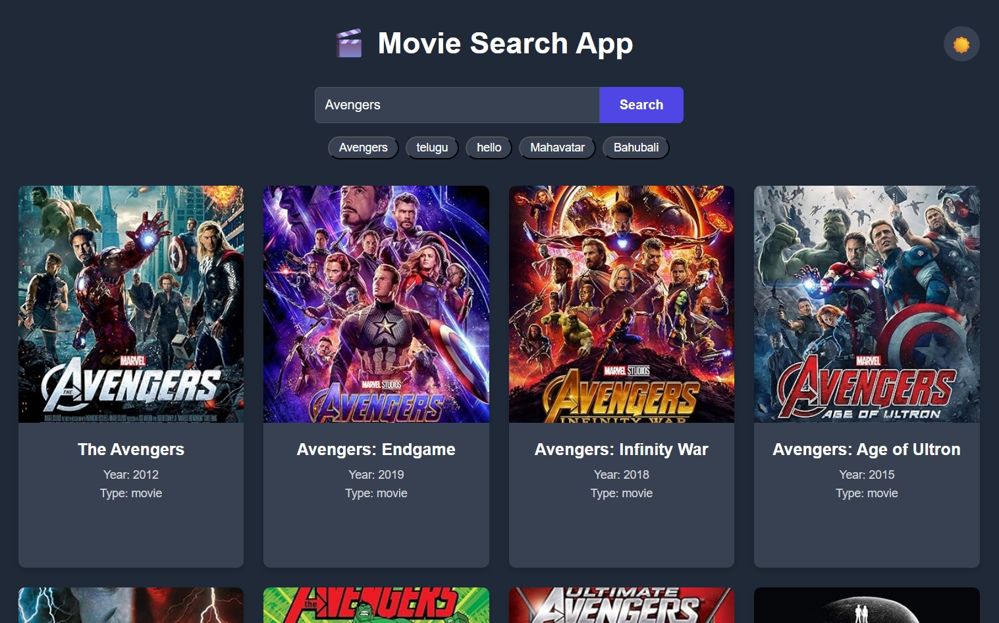

# Movie Search App

A sleek and responsive React application that allows users to search for movies and view their details. This app utilizes the OMDb API to fetch movie information and presents it in a clean, user-friendly interface.

## 🌟 Features

* **Movie Search:** Quickly search for movies by title.
* **Detailed Information:** View movie details such as poster, plot, year, rating, and more.
* **Responsive Design:** A fully responsive layout that works on all screen sizes.
* **User-Friendly Interface:** A simple and intuitive design for a seamless user experience.

## 🖼️ Screenshot



## 🛠️ Built With

* [React](https://reactjs.org/) - A JavaScript library for building user interfaces.
* [Vite](https://vitejs.dev/) - A fast build tool that provides a quicker and leaner development experience for modern web projects.
* [OMDb API](http://www.omdbapi.com/) - The Open Movie Database.
* Vanilla CSS

## 🚀 Getting Started

To get a local copy up and running, follow these simple steps.

### Prerequisites

You will need to have [Node.js](https://nodejs.org/en/) and [npm](https://www.npmjs.com/) installed on your machine.

### Installation

1.  **Clone the repo**
    ```sh
    git clone https://github.com/Dhaneshvsp/Movie-Search-app.git
    ```
2.  **Navigate to the project directory**
    ```sh
    cd Movie-Search-app
    ```
3.  **Install NPM packages**
    ```sh
    npm install
    ```

### Configuration

1.  Get a free API Key at [http://www.omdbapi.com/apikey.aspx](http://www.omdbapi.com/apikey.aspx)
2.  Create a `.env` file in the root of your project.
3.  Add your API key to the `.env` file:
    ```
    VITE_API_KEY=your_api_key
    ```

### Run the app

To run the app in development mode, use the following command. This will open the app in your browser at `http://localhost:5173`.

```sh
npm run dev
